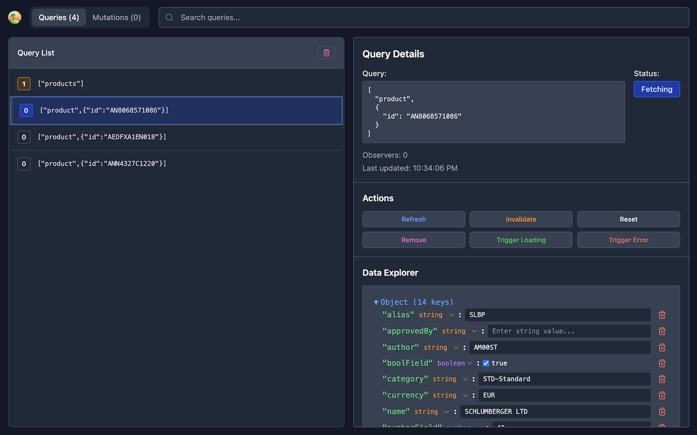

# TanStack Query DevTools

A professional browser extension for debugging TanStack Query applications across all frameworks.

[](https://chromewebstore.google.com/detail/tanstack-query-devtools/annajfchloimdhceglpgglpeepfghfai)
[](https://addons.mozilla.org/en-US/firefox/addon/tanstack-query-devtools/)
[](https://microsoftedge.microsoft.com/addons/detail/tanstack-query-devtools/edmdpkgkacmjopodhfolmphdenmddobj)

## ✨ Features

### 🔍 Advanced Debugging Capabilities

- **Real-time Query Inspection** - Live monitoring of all queries and mutations with instant state updates
- **Interactive Data Editing** - Edit query data directly in DevTools using professional JsonView interface
- **State Manipulation** - Trigger loading and error states for comprehensive UI testing
- **Complete Cache Management** - Invalidate, refetch, reset, and remove queries with one-click actions
- **Mutation Tracking** - Monitor mutations with variables, status, and result inspection



## Quick Start

1. **Install** the extension from your browser's extension store:
   - [Chrome Web Store](https://chromewebstore.google.com/detail/tanstack-query-devtools/annajfchloimdhceglpgglpeepfghfai)
   - [Firefox Add-ons](https://addons.mozilla.org/en-US/firefox/addon/tanstack-query-devtools/)
   - [Edge Add-ons](https://microsoftedge.microsoft.com/addons/detail/tanstack-query-devtools/edmdpkgkacmjopodhfolmphdenmddobj)

2. **Setup your application** to expose the query client globally:

   ```typescript
   const queryClient = new QueryClient({
     /* ... */
   });

   // This code is only for TypeScript
   declare global {
     interface Window {
       __TANSTACK_QUERY_CLIENT__: import("@tanstack/query-core").QueryClient;
     }
   }

   // This code is for all users
   window.__TANSTACK_QUERY_CLIENT__ = queryClient;
   ```

3. **Open** browser DevTools (F12) in your application
4. **Navigate** to the "TanStack Query" tab
5. **Start debugging** with real-time query inspection!

## 🏗️ Technical Architecture

### Multi-Context Extension Pattern

```
Web Application (TanStack Query)
    ↓ Detection & State Extraction
Injected Script (Application Context)
    ↓ Message Passing
Content Script (Bridge)
    ↓ Browser APIs
Background Service Worker
    ↓ DevTools Connection
React DevTools Panel
```

## 🔧 Development

### Local Development Setup

```bash
# Install dependencies
npm install

# Build extension
npm run build

# Load extension in your browser
# Chrome: chrome://extensions/ → Enable "Developer mode" → "Load unpacked" → Select `dist` folder
# Firefox: about:debugging → "This Firefox" → "Load Temporary Add-on" → Select `dist/manifest.json`
# Edge: edge://extensions/ → Enable "Developer mode" → "Load unpacked" → Select `dist` folder
```

## 🔗 Links

### Extension Stores

- [Chrome Web Store](https://chromewebstore.google.com/detail/tanstack-query-devtools/annajfchloimdhceglpgglpeepfghfai)
- [Firefox Add-ons](https://addons.mozilla.org/en-US/firefox/addon/tanstack-query-devtools/)
- [Edge Add-ons](https://microsoftedge.microsoft.com/addons/detail/tanstack-query-devtools/edmdpkgkacmjopodhfolmphdenmddobj)

### Documentation

- [TanStack Query Documentation](https://tanstack.com/query)
- [Browser Extension Development](https://developer.mozilla.org/docs/Mozilla/Add-ons/WebExtensions)
